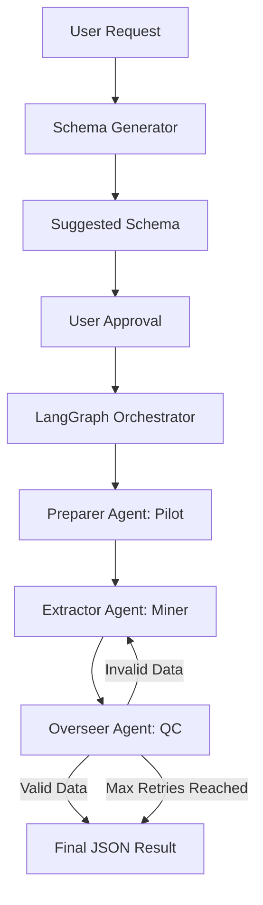

# LuminaScrape

LuminaScrape is a modular, autonomous browser agent framework designed for high-precision web data extraction. By utilizing a multi-agent orchestration via LangGraph, LuminaScrape handles complex navigation, anti-bot bypasses, and multi-step data extraction loops with human-level reasoning.

**Author:** Abrar Shah <abrarshah478@gmail.com>

---

## Technical Architecture

The system follows a three-tier agentic architecture, where specialized agents collaborate to visit, clean, and extract data from any target website.

### 1. The Agents
- **Preparer Agent:** Acting as the "pilot," this agent uses **Llama 3.2 Vision** to analyze the visual state of the page. It is responsible for bypassing Cloudflare, solving CAPTCHAs, and managing cookie consent banners to ensure a clean DOM for extraction.
- **Extractor Agent:** This agent utilizes **DeepSeek-R1 (8B)** to process the page context (AXTree and Markdown). It transforms unstructured web content into highly accurate, structured JSON data based on a pre-defined schema.
- **Overseer Agent:** The quality control layer. It validates the output of the Extractor against the original user prompt. If the data is incomplete or inaccurate, it triggers a recursive retry loop (up to a configurable limit) to refine the extraction.

### 2. The Tools
LuminaScrape is equipped with a suite of specialized tools:
- **Stealth & Navigation:** Integrated `playwright-stealth` with custom fingerprint rotation.
- **Content Crawling:** Utilizes `Crawl4AI` for high-speed Markdown conversion.
- **Accessibility Analysis:** Captures AXTree snapshots to give the agents a structural understanding of interactive elements.
- **Blockade Busting:** Automated handlers for ReCaptcha, HCaptcha, and Cloudflare challenges.

### 3. The Models
The framework is optimized for local execution via **Ollama**, ensuring data privacy and cost-efficiency:
- **Llama 3.2 Vision:** Chosen for the Preparer Agent due to its superior visual understanding, allowing the agent to "see" and interact with UI elements like a human.
- **DeepSeek-R1 (8B):** Chosen for the Extractor and Overseer Agents because of its advanced reasoning capabilities. It excels at understanding complex instructions and maintaining high structural integrity in JSON outputs.

---

## Execution Flow



---

## API Endpoints

### 1. Generate Schema
**Endpoint:** `POST /api/v1/generate-schema`  
Analyzes the user's natural language prompt and suggests a JSON structure. This step is browser-less and focused on architectural reasoning.

**Request Body:**
```json
{
  "url": "https://www.justwatch.com/",
  "prompt": "Provide Top 10 trending movies with their imdb rating and genre"
}
```

**Response Body:**
```json
{
  "session_id": "3883c1b9-bd74-43c5-8b8c-a1bdf2d420fe",
  "generated_schema": {
    "meta": {
      "count": 10,
      "trending_source": "justwatch"
    },
    "data": [
      {
        "title": "string",
        "imdb_rating": "number",
        "genres": ["string", "string"],
        "popularity_rank": "number"
      }
    ]
  }
}
```

### 2. Execute Scrape
**Endpoint:** `POST /api/v1/scrape`  
Starts the autonomous scraping process using the session data and the approved schema.

**Request Body:**
```json
{
  "session_id": "3883c1b9-bd74-43c5-8b8c-a1bdf2d420fe",
  "generated_schema": {
    "meta": {
      "count": 10,
      "trending_source": "justwatch"
    },
    "data": [
      {
        "title": "string",
        "imdb_rating": "number",
        "genres": ["string", "string"],
        "popularity_rank": "number"
      }
    ]
  }
}
```

**Response Body:**
```json
{
  "task_id": "c8268980-9ffc-4a7d-a126-b82585c0013e",
  "status": "pending"
}
```

### 3. Get Task Status
**Endpoint:** `GET /api/v1/status/{task_id}`  
Retrieves the status and the final extracted data.

**Response Body:**
```json
{
  "task_id": "c8268980-9ffc-4a7d-a126-b82585c0013e",
  "status": "completed",
  "data": {
    "meta": { "count": 10, "trending_source": "justwatch" },
    "data": [
      {
        "title": "Oppenheimer",
        "imdb_rating": 8.4,
        "genres": ["Drama", "History"],
        "popularity_rank": 95
      },
      ...
    ]
  },
  "error": null
}
```

---

## Getting Started

1. **Configure Environment:** Copy `.env.example` to `.env` and provide necessary API keys.
2. **Install Dependencies:**
   ```bash
   pip install -r requirements.txt
   playwright install chromium
   ```
3. **Run API Server:**
   ```bash
   python -m fastapi run api/main.py --port 8002
   ```

The system will automatically start the Ollama service on launch and shut it down upon exit.
